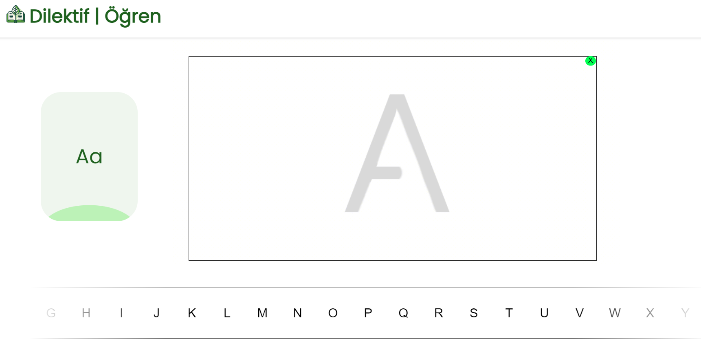

# Dilective

> Dilective is an interactive playground for young learners to create, adapt and learn. Dilective uses custom models built from scratch to recognize handwritten units to create an entertaining platform.

## Screenshot


## Getting Started

These instructions will get you a copy of the project up and running on your local machine for development and testing purposes. See deployment for notes on how to deploy the project on a live system.


### Installing

A step by step series of examples that tell you how to get a development env running

Say what the step will be

1. **Clone the repository**:
    ```bash
    git clone https://github.com/haldonmez/dilective-app.git
    cd dilective-app
    ```

2. **Install the necessary requirements**:
    ```bash
    pip install -r requirements.txt
    ```

3. **Once installed start the flask app**:
    ```bash
    flask run
    ```

End with an example of getting some data out of the system or using it for a little demo

## Running the tests


This project includes automated tests that validate functionality across all core components, ensuring that models, utility functions, prediction modules, and Flask endpoints perform as expected.

To run all tests, use the following command from the project root:

```bash
pytest tests/
```

## License

This project is licensed under the MIT License - see the [LICENSE.md](LICENSE.md) file for details

